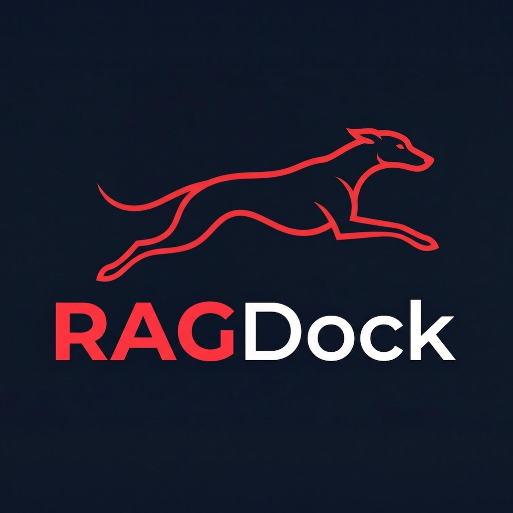

<p align='center'>
  
</p>

# RAGDock

> **The Universal Local RAG Hub for Your Private Knowledge Base.**  
> *Privacy-first, Model-agnostic, and Lightweight.*

[](https://opensource.org/licenses/Apache-2.0)
[](https://go.dev/)
[](https://github.com/RAGDock/RAGDock)
[](https://github.com/RAGDock/RAGDock/pulls)

RAGDock is a high-performance, cross-platform desktop application that transforms your local documents into a searchable, intelligent knowledge base. Built with Go, Wails, and SQLite, it provides a "dock" where you can plug in any local LLM (via Ollama) or embedding model (via ONNX) to interact with your data—100% offline.

---

## ✨ New Features & Improvements

- **🚀 Independent Model Routing**: Configure different models for VLM (image processing) and RAG (chat) to balance speed and accuracy.
- **🌐 Full i18n Support**: Seamlessly switch between **Chinese (zh)** and **English (en)** via `.env`. Both UI and AI System Prompts adapt to your language.
- **🔍 Deep Reference Traceability**: Every answer now includes a collapsible "Local References" section, showing filenames, paths, sizes, and modification times of the source data.
- **🛡️ Enhanced Privacy Control**: Strictly limit AI answers to your local knowledge base or allow for supplemental general knowledge via prompt configuration.

---

## Key Features

- **Model Agnostic**: Seamlessly switch between different LLMs via [Ollama](https://ollama.com/) or use built-in ONNX models for embeddings. No vendor lock-in.
- **Privacy by Design**: All data stays on your machine. Parsing, vectorization, and inference happen entirely locally.
- **Lightweight & Fast**: Powered by a Go backend and a specialized SQLite vector extension for sub-millisecond retrieval.
- **True Cross-Platform**: Optimized binaries for Windows, macOS (Intel/Apple Silicon), and Linux.
- **Multi-Format Support**: Intelligent parsing for Markdown, PDF, TXT, and images.
- **Modern UI/UX**: A clean, intuitive interface built with Svelte and Wails for a native desktop experience.

---

## ⚙️ Configuration (.env)

Customize your RAGDock experience in the `.env` file:

```env
# 1. Language Setting (zh/en)
APP_LANGUAGE=en

# 2. VLM (Vision) Model - Default for OCR
VLM_MODEL=qwen2.5-vl:3b

# 3. RAG (Chat) Model - Default for Chat
RAG_MODEL=qwen2.5:3b

# 4. Search Depth
RAG_K=3
```

---

## Architecture

RAGDock acts as the orchestration layer between your data and your models:

1.  **Ingestion**: Documents are parsed and cleaned locally.
2.  **Vectorization**: Text chunks are converted into embeddings using local ONNX models.
3.  **Storage**: Vectors and metadata are stored in a local SQLite database with `vec0` extensions.
4.  **Retrieval**: Context-aware search finds the most relevant snippets for your query.
5.  **Generation**: Local LLMs (Ollama) generate precise answers based on the retrieved context.

---

## Resource Setup

For RAGDock to function correctly, specific system libraries and model files must be placed in the `resources` directory. 

### 1. System Libraries (`resources/lib/`)
| File Name | Purpose |
| :--- | :--- |
| `libonnxruntime.dylib` / `.so` / `.dll` | ONNX Runtime engine |
| `vec0.dylib` / `.so` / `.dll` | SQLite vector search extension |

### 2. Embedding Models (`resources/models/`)
| File Name | Description |
| :--- | :--- |
| `model.onnx` | ONNX-format embedding model (e.g., BGE-Small) |
| `tokenizer.json` | JSON configuration for the tokenizer |

---

## Verified Models

| Category | Model Name (Ollama) | RAG | VLM | Accuracy | **RAM Needed** | Strengths |
|:---|:---|:---:|:---:|:---|:---|:---|
| **VLM** | `qwen2.5-vl:7b` | ✅ | ✅ | **Top** | **~8.5 GB** | Exceptional OCR & layout recovery. |
| **VLM** | `qwen2.5-vl:3b` | ✅ | ✅ | Good | **~4.8 GB** | Best balance for 8GB VRAM Macs. |
| **VLM** | `minicpm-v:8b-2.6` | ✅ | ✅ | Very Good | **~6.5 GB** | **Fastest** VLM indexing speed. |
| **VLM** | `qwen2-vl:2b` | ✅ | ✅ | Good | **~3.2 GB** | Excellent for low-resource OCR. |
| **RAG** | `gemma2:9b` | ✅ | ❌ | Very Good | **~6.2 GB** | Strong reasoning & factual accuracy. |
| **RAG** | `gemma2:2b` | ✅ | ❌ | Very Good | **~2.4 GB** | Small but very capable for RAG. |
| **Chat** | `qwen2.5:1.5b` | ✅ | ❌ | Good | **~1.6 GB** | Ultra-fast on low-resource hardware. |
| **Reasoning** | `DeepSeek-R1-Distill-Qwen-1.5B` | ✅ | ❌ | Very Good | **~1.8 GB** | High-speed logic & structured output. |

> **Hardware Note**: For **VLM (Vision)** models, additional 1.5GB–2.5GB RAM is consumed by vision encoders and image tokens. On Apple Silicon (Mac), this is handled via Unified Memory. On Windows/Linux, ensure your dedicated GPU VRAM is at least 1GB larger than the "RAM Needed" for a smooth experience.

---

## 🛠️ Build & Development

To build RAGDock from source, please refer to our **[BUILD_GUIDE.md](./BUILD_GUIDE.md)** for detailed platform-specific instructions.

```bash
# Quick Start for Dev
cd frontend && npm install
cd ..
wails dev
```

---

## License

Distributed under the Apache License 2.0. See `LICENSE` for more information.

---

## Contact

**RAGDock Team** - [GitHub](https://github.com/RAGDock)

*"Empowering everyone with their own local intelligence hub."*
